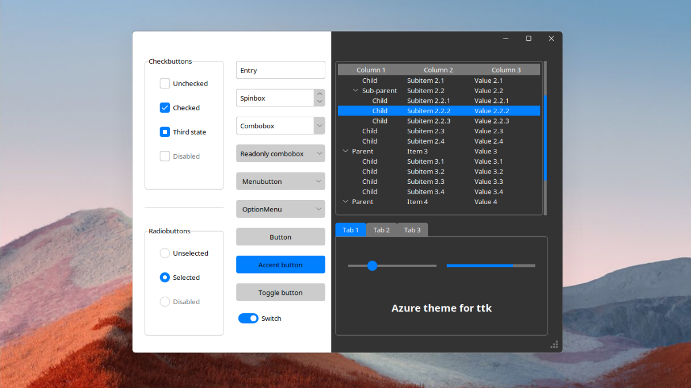

# Azure theme for ttk



## How to use?
Just like for my [Sun Valley](https://github.com/rdbende/Sun-Valley-ttk-theme) theme in version 2.0 I wanted to make usage of the theme very simple, so the theme setting is handled by a separate tcl script.
This way whether you want to use a dark or light theme, you need to import just a single file. The other thing that makes this a good solution is that normally switching between light and dark theme is not entirely perfect, and the colors are not correct.

```python
# Just simply import the azure.tcl file
widget.tk.call("source", "azure.tcl")

# Then set the theme you want with the set_theme procedure
widget.tk.call("set_theme", "light")
# or
widget.tk.call("set_theme", "dark")
```

### Changing themes
Normally changing between themes isn't that easy, because then the colors aren't correct. See this [Stackoverflow question](https://stackoverflow.com/questions/66576662/how-to-switch-between-dark-and-light-ttk-theme). However, with my current solution, you can change theme at any time, without any color issues.

```python
import tkinter as tk
from tkinter import ttk

root = tk.Tk()

# Pack a big frame so, it behaves like the window background
big_frame = ttk.Frame(root)
big_frame.pack(fill="both", expand=True)

# Set the initial theme
root.tk.call("source", "azure.tcl")
root.tk.call("set_theme", "light")

def change_theme():
    # NOTE: The theme's real name is azure-<mode>
    if root.tk.call("ttk::style", "theme", "use") == "azure-dark":
        # Set light theme
        root.tk.call("set_theme", "light")
    else:
        # Set dark theme
        root.tk.call("set_theme", "dark")

# Remember, you have to use ttk widgets
button = ttk.Button(big_frame, text="Change theme!", command=change_theme)
button.pack()

root.mainloop()
```

## New style elements
Azure theme has a style for every ttk widget, but there are some **new** widget styles, such as an accent button, toggle switch, toggle button, tickscale, and card. You can apply these with the style parameter.

If you need a highlighted button, use `Accent.TButton`:
```python
accent_button = ttk.Button(root, text='Accent button', style='Accent.TButton', command=callback)
```

To create a toggle button you need a checkbutton, to which you can apply the `Toggle.TButton` style:
```python
toggle_button = ttk.Checkbutton(root, text='Toggle button', style='Toggle.TButton', variable=var)
```

The use of switches instead of checkboxes is becoming more common these days, so this theme has a `Switch.TCheckbutton` style, that can be applied to checkbuttons:
```python
switch = ttk.Checkbutton(root, text='Switch', style='Switch.TCheckbutton', variable=var)
```

If you don't like the big circle on the scale, you prefer something more solid, then use the `Tick.TScale` style:
```python
tick_scale = ttk.Scale(root, style='Tick.TScale', variable=var)
```

If you only want a border around your widgets, not an entire LabelFrame then apply the `Card.TFrame` style to a Frame:
```python
card = ttk.Frame(root, style='Card.TFrame', padding=(5, 6, 7, 8))
```

## Bugs
- Tk isn't really good at displaying `png` images, so if your program is laggy with the theme, please check out the [gif-based branch!](https://github.com/rdbende/Azure-ttk-theme/tree/gif-based/)
- If your app has a treeview widget, and you change the theme the window will expand horizontally. This is a quite strange bug that applies to all ttk themes. 

If you scrolled down here, please check out my other themes!
- [Sun Valley ttk theme](https://github.com/rdbende/Sun-Valley-ttk-theme) a theme that looks like Windows 11!
- [Forest ttk theme](https://github.com/rdbende/Forest-ttk-theme) a theme inspired by Excel's look.
