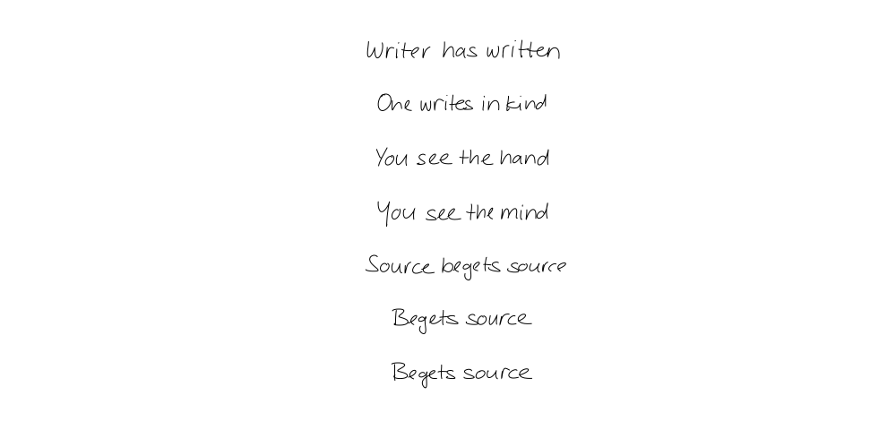

# Poetai

A tool for human-machine collaboration in poetry.

An implementation of the handwriting synthesis experiments from <a href="https://arxiv.org/abs/1308.0850">Generating Sequences with Recurrent Neural Networks</a> by Alex Graves.  The implementation closely follows the original paper, with a few slight deviations, and the generated samples are of similar quality to those presented in the paper.

Based on: [github.com/sjvasquez/handwriting-synthesis](https://github.com/sjvasquez/handwriting-synthesis)

## Example

```python
# main.py

from hand import Hand


if __name__ == '__main__':

    hand = Hand()

    lines = [
        "Writer has written",
        "One writes in kind",
        "You see the hand",
        "You see the mind",
        "Source begets source",
        "Begets source",
        "Begets source"
    ]
    biases = [.75 for i in lines]
    styles = [5 for i in lines]
    stroke_colors = ['black' for i in lines]
    stroke_widths = [1 for i in lines]
    
    hand.write(
        filename='img/out/source.svg',
        lines=lines,
        biases=biases,
        styles=styles,
        stroke_colors=stroke_colors,
        stroke_widths=stroke_widths,
        output_png=False
    )
```

## Output

