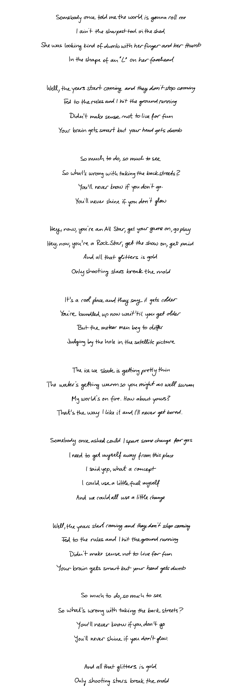
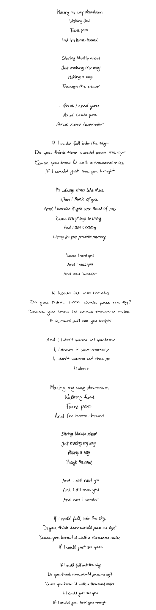
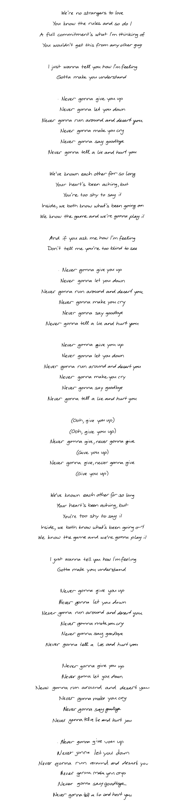

# Handwriting Synthesis
Implementation of the handwriting synthesis experiments in the paper <a href="https://arxiv.org/abs/1308.0850">Generating Sequences with Recurrent Neural Networks</a> by Alex Graves.  The implementation very closely follows the original paper, with a few slight deviations, and the generated samples are of similar quality to those presented in the paper.

Below are a few hundred samples from the model, including some samples demonstrating the effect of priming and biasing the model.  Loosely speaking, biasing controls the neatness of the samples and priming controls the style of the samples. The code for these demonstrations can be found in `demo.py` and should be fairly easy to modify for your own purposes.  A pretrained model is also included in `checkpoints/`.

## Demo #1
The following samples were generated with a fixed style and fixed bias.

## Demo #2
The following samples were generated with varing style and fixed bias.  Each verse is generated in a different style.

## Demo #3
The following samples were generated with a fixed style and varying bias.  Each verse has a lower bias than the previous, with the last verse being unbiased.

